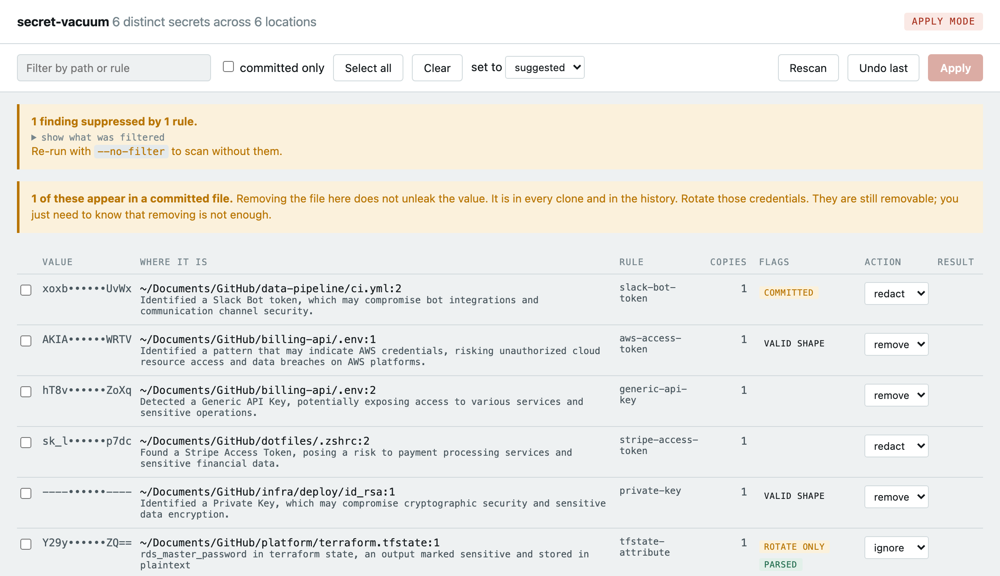

# secret-vacuum

Finds plaintext credentials sitting on your machine and deletes the ones you approve.

Two scripts, a page and a config. No pip install, no npm, no build step. macOS, Linux and Windows.

Detection is [gitleaks](https://github.com/gitleaks/gitleaks)' ruleset plus parsers for the formats
whose fields are credentials by definition -- Terraform state, `.env`, Docker `config.json`,
kubeconfig, Dockerfiles. Patterns alone miss those: a value whose variable name is not in the
keyword list, or one that is base64 inside a state file, looks like nothing to a regex.

**Nothing is filtered silently.** Every finding this tool drops is counted, attributed to a named
rule with a reason, and one click from being shown. A scan that filtered everything must never look
like a scan that found nothing.



```
brew install gitleaks
git clone https://github.com/mitch-zink/secret-vacuum && cd secret-vacuum
python3 secret_vacuum.py            # preview, opens a local UI
python3 secret_vacuum.py --apply    # same UI, changes enabled
```

## What it does

```
python3 secret_vacuum.py scan       # masked table on stdout, no UI, read only
python3 secret_vacuum.py            # UI in your browser, read only
python3 secret_vacuum.py --apply    # UI with the actions enabled
python3 secret_vacuum.py undo       # put the last batch back
python3 secret_vacuum.py env        # what cannot be deleted: env vars, containers, keystore
```

| flag | what it changes |
|---|---|
| `--quick` | the known credential stores only. Seconds instead of minutes. |
| `--root PATH` | scan this instead of the defaults, repeatable |
| `--no-filter` | report everything, including what the suppressors would drop |
| `--verify live` | also ask each provider whether the credential still works. Off by default. |

The default scope is your home directory minus a deny-list of caches, VM images and OS containers.
An allow-list of known dotfiles was the earlier default and it was wrong the moment a vendor invented
a new one. The first run takes minutes; `--quick` is the old behaviour when you want it back.

## One row per secret, not per hit

A scan of a real machine is dominated by the same credential appearing over and over: seven
worktrees of one repo, a value pasted into three config files, a token echoed through committed
logs. secret-vacuum groups findings by the value itself, so each row is one credential and the
`copies` column says how many places it lives. An action applies to every copy.

On the machine this was built against that is the difference between **2,036 rows and 118**. It is
the same data either way; one of them is a list you can actually work through.

Three actions per secret:

| Action | What happens on disk | For |
|---|---|---|
| **remove** | every file holding the value moves to `~/.secret-vacuum/trash/<batch>/`, paths preserved | `.env`, `*.pem`, `id_rsa`: files that are nothing but credential |
| **redact** | the file is copied to the trash, then the secret is replaced in place with `<removed by secret-vacuum>` | `.zshrc`, `settings.json`, `.mcp.json`: one bad line in a file you need |
| **ignore** | each copy's fingerprint is appended to `~/.secret-vacuum/.gitleaksignore` | false positives: presigned URLs, UUIDs, pagination cursors, content hashes |

Each row is pre-set to the safer of the two: whole-file **remove** only for files that are nothing
but credential, **redact** for everything else. **Select all** then **Apply** takes that mix in one
go. To override it, **set to** changes every selected row at once; rows that cannot take the action
keep their own and say so, so bulk *remove* never deletes a shell history to get at one line of it.
The confirm names every file that is about to move to the trash rather than only counting secrets.

Terraform state is reported and never edited. A line-level replace leaves valid JSON that no longer
describes reality, so the next `apply` destroys and recreates, and deleting the file is worse. The
only honest action there is to rotate the credential upstream. More generally, a redaction that
leaves a structured document unparseable is rolled back from its own backup.

`undo` restores the most recent batch, moving files back rather than copying them, so a restored secret does not linger in the trash as a second plaintext copy. Batches you do not undo stay until you delete them yourself.

## What it ignores, and why

Two kinds of noise drown the real findings on a developer machine, and both are suppressed in
`gitleaks.toml`:

**Code you did not write.** `node_modules`, `.venv`, `site-packages`, `dist`, `.terraform`,
lockfiles, and editor extension directories (`~/.cursor/extensions`, `~/.vscode/extensions`),
downloaded plugin and skill content, and local application databases and their write-ahead logs.
On the machine this was built against, editor extensions alone accounted for 20 findings, several
of which were Win32 API function names.

**Documentation placeholders.** `YOUR_ACCESS_TOKEN`, `<your-token>`, `CHANGEME`, `${MY_TOKEN}`,
`1234567890abcdef` and friends. Downloaded plugin docs are full of example `curl` commands.

Together that took a real dotfile scan from 36 findings to 10, and all 10 were genuine.

The config is passed with `--config`, so a scanned repository's own `.gitleaks.toml` cannot
allowlist away its leaks behind your back. Anything the shipped list gets wrong for you goes in
`~/.secret-vacuum/.gitleaksignore` via the Ignore action.

A root that cannot be scanned is reported as a failure in the UI and on the command line, never
counted as clean. If no root can be scanned at all, the tool errors out.

## Secrets already committed to a repo

A secret in a past commit is in every clone and in the history. Deleting the working-tree file
does not unleak it. The UI marks those **committed** and says so, then removes them anyway if you
approve, because you still want the plaintext copy off your disk. **Rotate them.**

secret-vacuum never rewrites git history and never force-pushes. That is not a thing a checkbox
should do.

## What gets scanned

Your home directory, minus caches, VM images, OS containers, `node_modules`, virtualenvs,
`site-packages`, build output and `.git` internals. Roots are derived from `Path.home()` and the
platform's own conventions, never from a path baked into the source.

`--quick` narrows it to the stores an infostealer walks: cloud CLI configs (`.aws`, `.azure`,
`gcloud`, `.oci`), `.kube`, `.docker/config.json`, `.ssh`, `.terraform.d`, package registry auth
(`.npmrc`, `.pypirc`, `.gem`, `.m2`, `.gradle`, `.cargo`), database clients, AI agent and MCP config
(`.claude.json`, `.cursor`, `.continue`), every shell startup file and both histories. Seconds
rather than minutes.

Shell history files are shown and redactable but never removable as a whole file, on every platform
including PowerShell's `ConsoleHost_history.txt`. Rewriting your history wholesale is its own kind
of damage.

## Is it still live?

Two answers, and only the first is on by default.

**Offline**, with no network at all: a JWT carries its own expiry, a private key parses or it does
not, an AWS key id has a fixed shape. Every finding reports `live-shape`, `expired`, `malformed` or
`unknown`, and the table sorts by exploitability rather than by presence.

**`--verify live`** asks each provider whether the credential actually works. That is the difference
between a guess and an answer, and it is also a real request with your credential: it lands in the
provider's audit log, it can trip impossible-travel alerts, it consumes rate limit, and against a
honeytoken it *is* the alarm. So it is off by default, it prints every host it will contact before
the first call, a rate-limited or unreachable check reports `unknown` rather than `revoked`, and a
credential in a canary-shaped path or in `~/.secret-vacuum/canaries.txt` is never verified.

It lives in `verify.py`, which `secret_vacuum.py` imports only inside the one function `--verify
live` reaches. The scanner, the local server and the UI have no network capability at all — that
stays a property of the code rather than of a flag.

## What cannot be deleted

```
python3 secret_vacuum.py env --docker --keychain
```

An exported variable has no file to remove, so `env` traces each credential-shaped variable back to
the file that set it and tells you which ones nothing on disk explains. Running containers are
listed by variable name and image. The OS keystore is inventoried by service name, with no delete
action, because that is where a secret is supposed to live. None of the three ever prints a value.

Redacting a file does not unset a variable in shells already running. Start a new shell, or `unset`
it, once you have dealt with the file.

## Guarantees

Each of these is a test in `test_secret_vacuum.py`.

1. **No secret value is ever written to disk by this tool.** The gitleaks report streams to stdout
   and stays in memory. Anything recorded on disk holds a path, a line number, a rule id and a
   SHA-256 prefix — never the value.
2. **Remove means move, not unlink.** Every removal lands in the trash and `undo` reverses it.
3. **The server is loopback-only.** It binds `127.0.0.1` on a random port, requires a 32-byte
   per-run token, rejects any request whose `Host` is not the literal loopback address (DNS
   rebinding), rejects a foreign `Origin`, and never emits a CORS header. Request logging is off
   because the URL carries the token.
4. **Nothing leaves the machine.** No telemetry, no update check, no network call from the scanner,
   the server or the UI — a test asserts `secret_vacuum.py` cannot reach the network at all.
   `--verify live` is the single exception, opt-in per run, confined to `verify.py`, and pinned so a
   verifier can only ever contact the service that issued the credential it is checking.
5. **Nothing is dropped silently.** Every suppressed finding is counted and attributable. Skipping a
   generated tree is the only quiet filtering, because listing several million skipped files tells
   you nothing.

Writes are off unless you pass `--apply`.

## Tests

```
python3 test_secret_vacuum.py    # no framework needed
python3 -m pytest -q             # works too
```

The end-to-end tests shell out to the real gitleaks binary against fixture directories. Test
credentials are assembled from split string literals at runtime so this repo does not trip
secret scanners, including its own pre-commit hook.

## Requirements

Python 3.10+ and the `gitleaks` binary. Nothing else: no pip install, no npm, no build step.
Tested on macOS, Linux and Windows in CI.

## License

MIT
